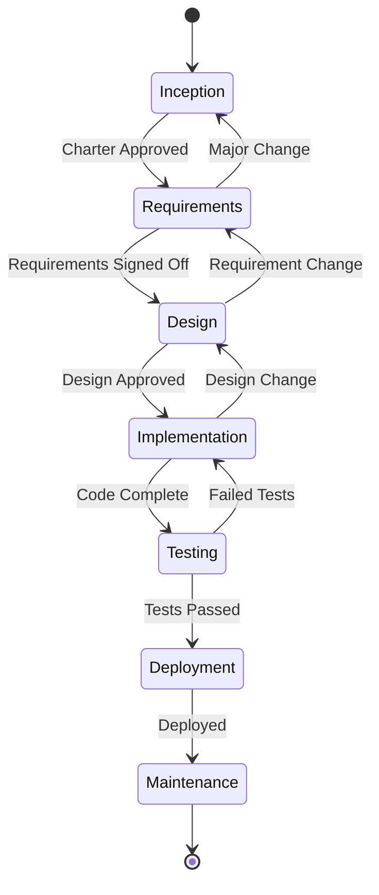

# AI Agentic SDLC Platform - Architecture & Implementation Plan

## 🎯 Vision Statement
Build an intelligent web application that guides users through the complete SDLC process using specialized AI agents, each responsible for specific phases and deliverables, orchestrated by a master controller to ensure consistency, traceability, and quality.

---

## 🏛️ System Architecture

### Core Components

```
┌─────────────────────────────────────────────────────────────┐
│                     User Interface Layer                      │
│  ┌──────────┐ ┌──────────┐ ┌──────────┐ ┌──────────────┐  │
│  │Dashboard │ │Chat UI   │ │Doc Viewer│ │Progress Track│  │
│  └──────────┘ └──────────┘ └──────────┘ └──────────────┘  │
└─────────────────────────────────────────────────────────────┘
                              ↕
┌─────────────────────────────────────────────────────────────┐
│                  Orchestration Layer                          │
│  ┌────────────────────────────────────────────────────┐    │
│  │         Master Orchestrator Agent                   │    │
│  │  • Process State Management                         │    │
│  │  • Agent Coordination                               │    │
│  │  • Conflict Resolution                              │    │
│  │  • Traceability Matrix Management                   │    │
│  └────────────────────────────────────────────────────┘    │
└─────────────────────────────────────────────────────────────┘
                              ↕
┌─────────────────────────────────────────────────────────────┐
│                    Agent Layer                                │
│  ┌─────────┐ ┌─────────┐ ┌─────────┐ ┌─────────┐          │
│  │Charter  │ │BRD      │ │SRS      │ │Design   │          │
│  │Agent    │ │Agent    │ │Agent    │ │Agent    │          │
│  └─────────┘ └─────────┘ └─────────┘ └─────────┘          │
│  ┌─────────┐ ┌─────────┐ ┌─────────┐ ┌─────────┐          │
│  │Test     │ │Deploy   │ │Backlog  │ │Docs     │          │
│  │Agent    │ │Agent    │ │Agent    │ │Agent    │          │
│  └─────────┘ └─────────┘ └─────────┘ └─────────┘          │
└─────────────────────────────────────────────────────────────┘
                              ↕
┌─────────────────────────────────────────────────────────────┐
│                    Data & Storage Layer                       │
│  ┌──────────────┐ ┌────────────┐ ┌───────────────┐        │
│  │Document Store│ │Version     │ │Knowledge Base │        │
│  │(MongoDB)     │ │Control     │ │(Vector DB)    │        │
│  └──────────────┘ └────────────┘ └───────────────┘        │
└─────────────────────────────────────────────────────────────┘
```

---

## 📋 Agent Registry & Build Order

### Phase 1: Foundation Agents
1. **Orchestrator Agent** - Master controller and state manager
2. **Charter/Vision Agent** - Project inception and scoping
3. **Document Management Agent** - Storage, versioning, retrieval

### Phase 2: Requirements Agents  
4. **BRD Agent** - Business requirements gathering
5. **SRS Agent** - Software requirements specification
6. **Traceability Agent** - Requirements mapping and tracking

### Phase 3: Design Agents
7. **System Design Agent** - Architecture and technical design
8. **Data Design Agent** - Database schema and data flow
9. **UI/UX Agent** - Interface design and user experience

### Phase 4: Implementation Agents
10. **Backlog Agent** - User stories and Gherkin scenarios
11. **Code Standards Agent** - Guidelines and best practices
12. **API Design Agent** - Interface specifications

### Phase 5: Quality & Deployment Agents
13. **Test Planning Agent** - Test strategy and cases
14. **Deployment Agent** - Release planning and CI/CD
15. **Operations Agent** - Maintenance and monitoring

---

## 🤖 Agent #1: Orchestrator Agent

### Purpose
The Orchestrator Agent is the central nervous system of the platform, managing workflow state, coordinating agent interactions, and ensuring consistency across all SDLC phases.

### Core Responsibilities
1. **Process State Management**
   - Track current SDLC phase
   - Maintain project context
   - Store conversation history
   - Manage document versions

2. **Agent Coordination**
   - Route requests to appropriate agents
   - Pass context between agents
   - Manage agent handoffs
   - Resolve inter-agent conflicts

3. **Quality Control**
   - Validate agent outputs
   - Ensure traceability
   - Check for completeness
   - Manage upstream/downstream changes

4. **User Interface**
   - Present progress dashboard
   - Facilitate user interactions
   - Provide guidance and suggestions
   - Generate reports

### Technical Architecture

```python
class OrchestratorAgent:
    def __init__(self):
        self.state_manager = StateManager()
        self.agent_registry = AgentRegistry()
        self.document_store = DocumentStore()
        self.traceability_matrix = TraceabilityMatrix()
        
    def process_request(self, user_input, project_id):
        # 1. Determine current phase
        current_phase = self.state_manager.get_phase(project_id)
        
        # 2. Route to appropriate agent
        agent = self.agent_registry.get_agent(current_phase)
        
        # 3. Prepare context
        context = self.prepare_context(project_id)
        
        # 4. Execute agent
        result = agent.execute(user_input, context)
        
        # 5. Validate and store
        self.validate_output(result)
        self.document_store.save(result)
        
        # 6. Update state
        self.state_manager.update(project_id, result)
        
        # 7. Check for downstream impacts
        impacts = self.traceability_matrix.check_impacts(result)
        
        return result, impacts
```

### API Endpoints

```javascript
// Core Orchestrator APIs
POST   /api/projects                 // Create new project
GET    /api/projects/{id}/status     // Get project status
POST   /api/projects/{id}/advance    // Move to next phase
POST   /api/projects/{id}/process    // Process user input
GET    /api/projects/{id}/documents  // Retrieve all documents
POST   /api/projects/{id}/rollback   // Rollback to previous state
```

### State Machine



---

## 🚀 Implementation Roadmap

### Sprint 1: Orchestrator Foundation (Weeks 1-2)
- [ ] Set up project repository
- [ ] Create basic web application structure
- [ ] Implement state management system
- [ ] Build document storage layer
- [ ] Create API framework

### Sprint 2: Orchestrator Core Logic (Weeks 3-4)
- [ ] Implement phase transition logic
- [ ] Build agent registry system
- [ ] Create context management
- [ ] Implement validation framework
- [ ] Add traceability matrix

### Sprint 3: User Interface (Weeks 5-6)
- [ ] Build dashboard UI
- [ ] Create chat interface
- [ ] Implement progress tracking
- [ ] Add document viewer
- [ ] Create project management screens

### Sprint 4: First Specialized Agent (Weeks 7-8)
- [ ] Select Charter/Vision Agent as first specialized agent
- [ ] Implement agent interface
- [ ] Create Q&A logic
- [ ] Build document generation
- [ ] Integrate with orchestrator

---

## 📊 Success Metrics

### Technical Metrics
- Response time < 2 seconds for agent interactions
- 99.9% uptime for orchestrator service
- Zero data loss for documents
- 100% traceability for all requirements

### Business Metrics
- Reduce SDLC documentation time by 70%
- Improve requirement coverage by 40%
- Decrease requirement conflicts by 60%
- Increase stakeholder satisfaction by 50%

---

## 🔧 Technology Stack

### Backend
- **Language**: Python 3.11+
- **Framework**: FastAPI
- **AI/LLM**: OpenAI API / Anthropic Claude API
- **Database**: MongoDB (documents), PostgreSQL (metadata)
- **Cache**: Redis
- **Queue**: RabbitMQ / Celery

### Frontend
- **Framework**: React 18 / Next.js 14
- **UI Library**: Material-UI / Ant Design
- **State Management**: Redux Toolkit
- **Chat UI**: react-chat-ui
- **Document Viewer**: react-pdf

### Infrastructure
- **Deployment**: Docker + Kubernetes
- **Cloud**: AWS / Azure / GCP
- **CI/CD**: GitHub Actions
- **Monitoring**: Prometheus + Grafana
- **Logging**: ELK Stack

---

## 🏁 Next Steps

### Immediate Actions (This Week)
1. **Create Project Charter** for the Orchestrator Agent
2. **Develop BRD** for the Orchestrator Agent
3. **Design SRS** with detailed requirements
4. **Set up development environment**
5. **Create project repository and structure**

### Questions to Answer
1. Which LLM provider to use? (OpenAI, Anthropic, both?)
2. Deployment preference? (Cloud provider, on-premise?)
3. User authentication method? (OAuth, SAML, custom?)
4. Document format priorities? (PDF, Markdown, Word?)
5. Integration requirements? (JIRA, Confluence, GitHub?)

---

## 📝 Development Process for Each Agent

### Standard Agent Development Lifecycle
1. **Charter**: Define agent purpose and scope
2. **BRD**: Document business requirements
3. **SRS**: Specify functional/non-functional requirements
4. **Design**: Create technical architecture
5. **Implementation**: Build the agent
6. **Testing**: Unit, integration, and acceptance tests
7. **Deployment**: Release to production
8. **Documentation**: User and technical docs
9. **Maintenance**: Monitor and improve

### Agent Interface Contract
```typescript
interface Agent {
  id: string;
  name: string;
  version: string;
  phase: SDLCPhase;
  
  // Core methods
  execute(input: UserInput, context: Context): Result;
  validate(output: any): ValidationResult;
  getCapabilities(): Capability[];
  getRequiredInputs(): InputSchema;
  
  // Lifecycle hooks
  onInit(): Promise<void>;
  onActivate(context: Context): Promise<void>;
  onDeactivate(): Promise<void>;
  onError(error: Error): ErrorResponse;
}