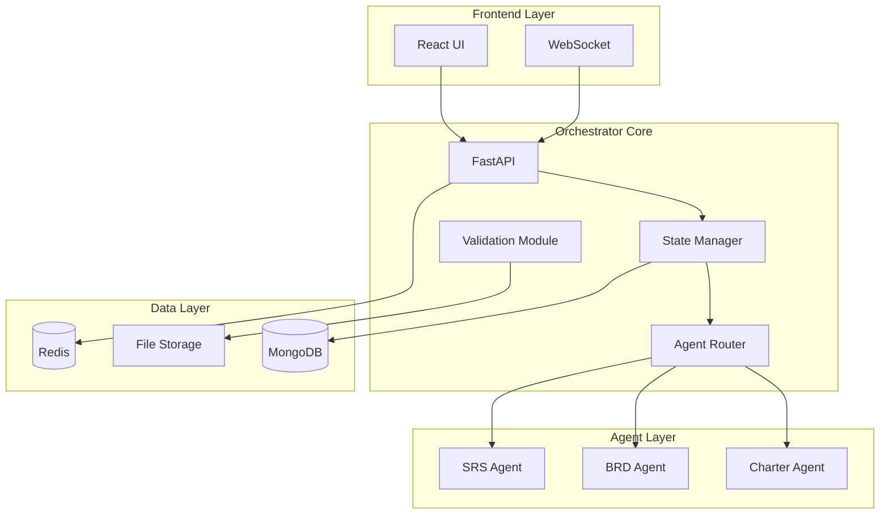

# Software Requirements Specification: Orchestrator Agent
**Version:** 1.0  
**Date:** 2024-12-19  
**Status:** DRAFT  
**Author:** AI SDLC Platform Team  
**References:** Project Charter v1.0, BRD v1.0

---

## 1. Introduction

### 1.1 Purpose
This SRS defines the software requirements for the Orchestrator Agent, the central component of the AI Agentic SDLC Platform. It serves as the contract between stakeholders and development team.

### 1.2 Scope
The Orchestrator Agent manages project lifecycle, coordinates specialized AI agents, maintains state, and ensures consistent delivery of SDLC documentation through an intuitive web interface.

### 1.3 Definitions & Acronyms
- **Agent**: Specialized AI component for specific SDLC tasks
- **Context**: Project state and accumulated knowledge
- **LLM**: Large Language Model (GPT-4, Claude)
- **State Machine**: System tracking project phases
- **Webhook**: HTTP callback for event notifications

### 1.4 System Overview
```
User → Web UI → Orchestrator API → State Manager → Agent Router → Specialized Agents → Document Store
```

---

## 2. System Architecture

### 2.1 High-Level Architecture


### 2.2 Operating Environment
- **Server**: Linux Ubuntu 22.04 LTS / Docker containers
- **Runtime**: Python 3.11+, Node.js 18+
- **Browsers**: Chrome 90+, Firefox 88+, Safari 14+, Edge 90+
- **Network**: HTTPS required, WebSocket support

---

## 3. Functional Requirements

### 3.1 User Management

#### FR-001: User Registration
**Priority:** High  
**Description:** System shall allow users to register accounts  
```gherkin
Given a new user accessing the platform
When they provide email and password
Then system creates account and sends verification email
And user can login after email verification
```

#### FR-002: Authentication
**Priority:** Critical  
**Description:** System shall authenticate users securely  
```gherkin
Given a registered user
When they provide valid credentials
Then system grants access token valid for 24 hours
And refresh token valid for 30 days
```

### 3.2 Project Management

#### FR-003: Project Creation
**Priority:** Critical  
**Description:** System shall enable project initialization  
```python
POST /api/projects
{
  "name": "E-commerce Platform",
  "description": "Online marketplace for retail",
  "type": "web_application",
  "methodology": "agile"
}

Response:
{
  "project_id": "PRJ-2024-0001",
  "status": "initialized",
  "current_phase": "charter",
  "created_at": "2024-12-19T10:00:00Z"
}
```

#### FR-004: Project State Management
**Priority:** Critical  
**Description:** System shall track project through SDLC phases  
**State Transitions:**
```
Charter → BRD → SRS → Design → Implementation → Testing → Deployment
```
**Validation Rules:**
- Cannot skip phases
- Required documents must exist
- Approval required for phase transition

### 3.3 Agent Orchestration

#### FR-005: Agent Selection
**Priority:** Critical  
**Description:** System shall route requests to appropriate agents  
```python
def select_agent(project_phase: str, request_type: str) -> Agent:
    agent_map = {
        "charter": CharterAgent,
        "requirements": BRDAgent,
        "specifications": SRSAgent
    }
    return agent_map[project_phase]()
```

#### FR-006: Context Management
**Priority:** Critical  
**Description:** System shall maintain and pass context between agents  
**Context Structure:**
```json
{
  "project_id": "PRJ-2024-0001",
  "current_phase": "requirements",
  "documents": {
    "charter": { "version": "1.0", "status": "approved" }
  },
  "conversation_history": [...],
  "metadata": {}
}
```

#### FR-007: Agent Communication
**Priority:** High  
**Description:** System shall facilitate inter-agent communication  
**Message Protocol:**
```python
class AgentMessage:
    sender: str
    recipient: str
    message_type: str  # query, response, handoff
    payload: dict
    timestamp: datetime
```

### 3.4 Document Management

#### FR-008: Document Generation
**Priority:** Critical  
**Description:** System shall generate professional documents  
**Supported Formats:**
- PDF (primary)
- Markdown (technical)
- HTML (web view)
- DOCX (optional)

#### FR-009: Version Control
**Priority:** High  
**Description:** System shall maintain document versions  
```python
class DocumentVersion:
    version: str  # "1.0.0"
    created_by: str
    created_at: datetime
    changes: List[str]
    approved: bool
    content: dict
```

#### FR-010: Document Storage
**Priority:** Critical  
**Description:** System shall store documents reliably  
**Storage Strategy:**
- Metadata: MongoDB
- Content: MongoDB GridFS
- Generated PDFs: S3-compatible storage
- Cache: Redis (recent documents)

### 3.5 Traceability

#### FR-011: Requirements Traceability
**Priority:** High  
**Description:** System shall maintain requirement linkages  
```json
{
  "requirement_id": "BR-001",
  "source": "stakeholder_interview_001",
  "implements": ["FR-003", "FR-004"],
  "tested_by": ["TC-001", "TC-002"],
  "status": "implemented"
}
```

#### FR-012: Change Impact Analysis
**Priority:** Medium  
**Description:** System shall analyze downstream impacts  
**Impact Categories:**
- Direct: Immediately dependent items
- Indirect: Transitively dependent items
- Suggested: Potentially affected items

### 3.6 User Interface

#### FR-013: Dashboard
**Priority:** High  
**Description:** System shall provide project overview dashboard  
**Components:**
- Project list with status
- Current phase indicator
- Progress metrics
- Recent activity feed
- Quick actions menu

#### FR-014: Chat Interface
**Priority:** Critical  
**Description:** System shall provide conversational interface  
**Features:**
- Real-time messaging
- Context-aware suggestions
- File uploads
- Rich formatting
- Command shortcuts

#### FR-015: Document Viewer
**Priority:** High  
**Description:** System shall display generated documents  
**Capabilities:**
- In-browser PDF viewing
- Syntax-highlighted markdown
- Version comparison
- Annotation support
- Export options

### 3.7 Integration

#### FR-016: LLM Integration
**Priority:** Critical  
**Description:** System shall integrate with LLM providers  
**Providers:**
- Primary: OpenAI GPT-4
- Fallback: Anthropic Claude
**Features:**
- Automatic failover
- Response caching
- Token optimization
- Rate limit handling

#### FR-017: Webhook Support
**Priority:** Medium  
**Description:** System shall send event notifications  
**Events:**
- Project created/updated
- Phase transition
- Document generated
- Approval required

---

## 4. Non-Functional Requirements

### 4.1 Performance

#### NFR-001: Response Time
- Chat responses: < 3 seconds
- Document generation: < 10 seconds
- Dashboard load: < 2 seconds
- API calls: < 500ms (excluding LLM)

#### NFR-002: Throughput
- Concurrent users: 100
- Requests per second: 50
- Active projects: 1000
- Documents per project: 100

### 4.2 Security

#### NFR-003: Authentication
- JWT-based authentication
- Bcrypt password hashing
- Rate limiting: 10 attempts/minute
- Session timeout: 24 hours

#### NFR-004: Authorization
- Role-based access control (RBAC)
- Project-level permissions
- Document access audit trail
- API key management

#### NFR-005: Data Protection
- TLS 1.3 for all communications
- Encryption at rest (AES-256)
- PII data masking in logs
- Regular security scans

### 4.3 Reliability

#### NFR-006: Availability
- Uptime: 99.5% (excluding maintenance)
- Planned maintenance: < 4 hours/month
- Recovery Time Objective: < 1 hour
- Recovery Point Objective: < 15 minutes

#### NFR-007: Fault Tolerance
- Graceful degradation
- Automatic retry with backoff
- Circuit breaker pattern
- Health check endpoints

### 4.4 Usability

#### NFR-008: User Experience
- Mobile responsive design
- WCAG 2.1 AA compliance
- Keyboard navigation support
- Loading indicators
- Error messages with solutions

#### NFR-009: Documentation
- Interactive tutorials
- Context-sensitive help
- API documentation
- Video guides

### 4.5 Scalability

#### NFR-010: Horizontal Scaling
- Stateless application design
- Container-based deployment
- Auto-scaling rules
- Load balancer ready

#### NFR-011: Data Scaling
- Database sharding capability
- CDN for static assets
- Lazy loading for large documents
- Pagination for lists

---

## 5. External Interfaces

### 5.1 User Interfaces

#### UI-001: Web Application
**Technology:** React 18 + TypeScript  
**Key Screens:**
1. Login/Register
2. Dashboard
3. Project Workspace
4. Chat Interface
5. Document Viewer
6. Settings

#### UI-002: Mobile Responsive
**Breakpoints:**
- Mobile: 320px - 768px
- Tablet: 768px - 1024px
- Desktop: 1024px+

### 5.2 API Interfaces

#### API-001: REST API
**Base URL:** `https://api.orchestrator.ai/v1`  
**Authentication:** Bearer token  
**Content-Type:** application/json

**Core Endpoints:**
```
POST   /auth/register
POST   /auth/login
GET    /projects
POST   /projects
GET    /projects/{id}
PUT    /projects/{id}/advance
POST   /projects/{id}/chat
GET    /projects/{id}/documents
POST   /projects/{id}/documents
```

#### API-002: WebSocket API
**URL:** `wss://api.orchestrator.ai/ws`  
**Events:**
- `chat.message`
- `project.update`
- `document.generated`
- `agent.status`

### 5.3 Hardware Interfaces
Not applicable - cloud-based solution

### 5.4 Communication Interfaces

#### COM-001: LLM Provider APIs
**OpenAI:**
- Endpoint: https://api.openai.com/v1/
- Model: gpt-4-turbo-preview
- Max tokens: 4096

**Anthropic:**
- Endpoint: https://api.anthropic.com/v1/
- Model: claude-3-opus
- Max tokens: 4096

---

## 6. Use Cases

### 6.1 Use Case: Create New Project
**Actor:** Business Analyst  
**Precondition:** User logged in  
**Main Flow:**
1. User clicks "New Project"
2. System displays project form
3. User enters project details
4. System validates input
5. System creates project
6. System redirects to project workspace

**Alternative Flows:**
- A1: Invalid input → Show validation errors
- A2: Duplicate name → Suggest alternative

**Postcondition:** Project created and ready for charter

### 6.2 Use Case: Generate Document
**Actor:** Project Manager  
**Precondition:** Project exists, phase appropriate  
**Main Flow:**
1. User enters chat interface
2. User describes requirements
3. System asks clarifying questions
4. User provides answers
5. System generates document
6. User reviews document
7. User approves/requests changes

**Alternative Flows:**
- A1: Insufficient info → Request more details
- A2: Conflicting requirements → Flag for resolution

**Postcondition:** Document generated and stored

---

## 7. Data Requirements

### 7.1 Data Model

```python
# Core Entities
class Project:
    id: str
    name: str
    description: str
    status: str
    current_phase: str
    created_by: str
    created_at: datetime
    updated_at: datetime
    metadata: dict

class Document:
    id: str
    project_id: str
    type: str
    version: str
    content: dict
    status: str
    created_by: str
    created_at: datetime
    approved_by: Optional[str]
    approved_at: Optional[datetime]

class User:
    id: str
    email: str
    name: str
    role: str
    created_at: datetime
    last_login: datetime

class ConversationHistory:
    id: str
    project_id: str
    user_id: str
    agent: str
    messages: List[Message]
    created_at: datetime
```

### 7.2 Data Retention
- Active projects: Indefinite
- Archived projects: 7 years
- Conversation history: 1 year
- Audit logs: 3 years
- Temporary cache: 24 hours

---

## 8. Constraints

### 8.1 Technical Constraints
- Must use existing LLM APIs
- Browser-based interface only
- Maximum document size: 10MB
- Maximum project size: 1GB

### 8.2 Business Constraints
- English language only (v1)
- Single timezone support (UTC)
- No offline mode
- Limited to web applications

---

## 9. Appendices

### A. State Machine Definition
```python
PHASE_TRANSITIONS = {
    "initialization": ["charter"],
    "charter": ["requirements"],
    "requirements": ["specifications"],
    "specifications": ["design"],
    "design": ["implementation"],
    "implementation": ["testing"],
    "testing": ["deployment"],
    "deployment": ["maintenance"],
    "maintenance": ["end"]
}
```

### B. Error Codes
| Code | Description | User Action |
|------|-------------|-------------|
| E001 | Invalid credentials | Check username/password |
| E002 | Session expired | Re-login required |
| E003 | Insufficient permissions | Contact admin |
| E004 | Document generation failed | Retry or contact support |
| E005 | LLM service unavailable | Wait and retry |

### C. Acceptance Criteria Template
```gherkin
Feature: [Feature Name]
  As a [user role]
  I want [capability]
  So that [benefit]

  Scenario: [Happy Path]
    Given [initial context]
    When [action taken]
    Then [expected result]

  Scenario: [Error Case]
    Given [initial context]
    When [invalid action]
    Then [error handling]
```

---

## ✅ Requirements Baseline Established

**Ready for Technical Design Document (SDD/TDD)**